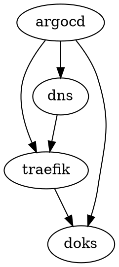
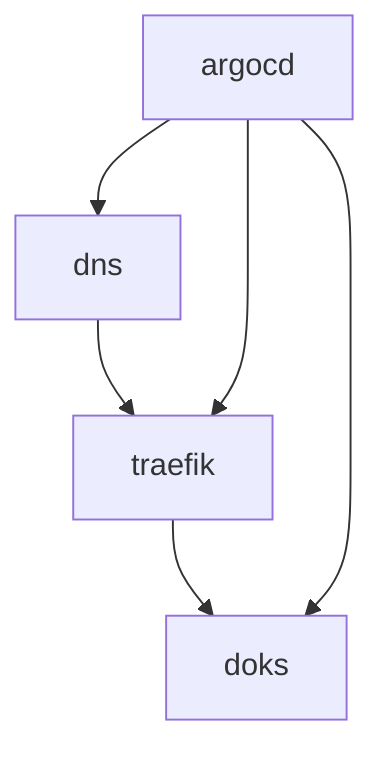

# DigitalOcean Kubernetes (DOKS) — Terragrunt + Terraform

This repository provisions a **DigitalOcean Kubernetes (DOKS)** cluster and supporting pieces: **project + domain**, **Traefik** ingress with **built-in ACME** (Let’s Encrypt DNS-01 via DigitalOcean), **DNS A records**, and **Argo CD** GitOps. Infrastructure is split into **Terragrunt stacks** under `live/dev/` with separate state per stack, explicit **dependencies**, and **DRY** shared config.

## Why Terragrunt?

- **Separate state** per layer (cluster vs addons vs DNS) for safer blast radius and parallel plans where possible.
- **`dependency` blocks** wire Kubernetes/Helm providers from the `doks` stack outputs (endpoint, token, CA).
- **`live/dev/env.hcl`** holds non-secret defaults; tokens and Argo CD password hash come from **`TF_VAR_*`** / **`DO_TOKEN`**.

## Stack layout and dependency graph

Terragrunt resolves dependencies from `live/dev/*/terragrunt.hcl` (`dependency` and `dependencies` blocks). **Verified** with `terragrunt graph-dependencies` from `live/dev/` (also: `./scripts/tg.sh graph`):



| Stack | Depends on | Purpose |
|-------|------------|---------|
| `doks` | — | DO project, domain, DOKS cluster, project↔resource attachment |
| `traefik` | `doks` | Traefik Helm (LoadBalancer), **ACME `letsencrypt` resolver** (DNS-01, `DO_AUTH_TOKEN`), dashboard `IngressRoute` |
| `dns` | `traefik` | DO DNS A records → Traefik LB IP |
| `argocd` | `doks`, `traefik`, `dns` | Argo CD + `argocd-apps` Application (`dependency` on `doks` for Helm kube config; `dependencies` so it runs after Traefik + DNS) |

**Apply order:** `terragrunt run-all apply` runs **`doks`** → **`traefik`** → **`dns`** → **`argocd`**.

**TLS:** Certificates are issued by **Traefik’s ACME** (certificate resolver `letsencrypt`), not cert-manager. The same DigitalOcean API token is stored in a Kubernetes secret and exposed to Traefik as **`DO_AUTH_TOKEN`** for the DNS challenge. Use Ingress / IngressRoute annotations such as `traefik.ingress.kubernetes.io/router.tls.certresolver: letsencrypt` for app hosts (see `k8s/apps/dev/loading-page/ingress.yaml`).



## Repository layout

```
.
├── Makefile                     # Shortcuts: tg-clean, tg-init, tg-plan, …
├── scripts/tg.sh                # Terragrunt helpers (cache, run-all, graph, env-check)
├── .env.example                 # Template for TF_VAR_* — copy to .env (gitignored)
├── live/
│   ├── root.hcl                 # Shared remote_state (local backend path per stack)
│   └── dev/
│       ├── env.hcl              # Non-secret locals (region, cluster size, domain, email, …)
│       ├── doks/terragrunt.hcl  # Only Terragrunt: inputs + terraform { source = … }
│       ├── traefik/
│       ├── dns/
│       └── argocd/
├── terraform/stacks/            # Terraform root modules (one directory per stack)
│   ├── doks/
│   ├── traefik/
│   ├── dns/
│   └── argocd/
├── modules/                     # Shared modules called from terraform/stacks/*
│   ├── digitalocean/cluster
│   ├── digitalocean/network
│   └── kubernetes/{traefik,argocd}
├── k8s/apps/dev/                # Sample manifests; path used by Argo CD
└── .github/workflows/terraform.yml   # terragrunt run-all validate/plan/apply
```

**Why split `live/` vs `terraform/stacks/`?**  
`live/` holds **environment-specific** Terragrunt only (dependencies, inputs, generated providers). **`terraform/stacks/`** holds the Terraform root modules once, referenced via `terraform { source = "${get_repo_root()}/terraform/stacks/<stack>" }`. That matches the usual pattern: **thin live config**, **one copy of each stack’s `.tf` files**, shared **`modules/`**.

### Implementation notes

- Each `live/dev/<stack>/terragrunt.hcl` **generates** a tiny `repo_paths.tf` (`local.repo_root = get_repo_root()`) so `${local.repo_root}/modules/...` resolves correctly after Terragrunt copies the stack into `.terragrunt-cache/`. Run stacks with **Terragrunt**, not raw `terraform` in `terraform/stacks/` alone, unless you add that file yourself for local experiments.
- Kubernetes-dependent stacks **generate** `providers.generated.tf` from **`dependency.doks.outputs`** (Helm uses the `kubernetes = { … }` map form required by **Helm provider v3**).
- **Mock outputs** on the `doks` / `traefik` dependencies allow `validate` / `plan` when upstream state is empty (CI / cold start). Real applies use outputs from state after each dependency is applied.

### Remote state

`live/root.hcl` uses a **local** backend with state stored next to each stack (`terraform.tfstate` in that stack directory). For teams, replace this block with **S3**, **GCS**, **Terraform Cloud**, etc., still via Terragrunt’s `remote_state` (see [Terragrunt remote state](https://terragrunt.gruntwork.io/docs/features/keep-your-remote-state-configuration-dry/)).

## Prerequisites

- [Terraform](https://www.terraform.io/) **>= 1.5** (or compatible OpenTofu)
- [Terragrunt](https://terragrunt.gruntwork.io/) (see `TG_VERSION` in `.github/workflows/terraform.yml` for the CI pin)
- DigitalOcean API token with permissions for Kubernetes, DNS (for ACME DNS-01), and project resources

## Configure secrets

Export (or use a private `*.auto.tfvars` / CI secrets):

| Variable | Purpose |
|----------|---------|
| `TF_VAR_do_token` or `DO_TOKEN` | DigitalOcean API token (provider + **Traefik ACME DNS challenge**) |
| `TF_VAR_argocd_admin_password_hash` | Bcrypt hash for Argo CD `admin` |

`live/dev/env.hcl` sets **`email`** for ACME registration (non-secret).

Local file (recommended): copy **`.env.example`** to **`.env`** in the repo root (`.env` is gitignored), then:

```bash
set -a && source .env && set +a
```

## Helpers (Makefile and `scripts/tg.sh`)

| Command | What it does |
|---------|----------------|
| `make tg-clean` / `./scripts/tg.sh clean-cache` | Delete all `live/**/.terragrunt-cache` directories (forces a fresh module copy on next run) |
| `make tg-init` / `./scripts/tg.sh init-all` | `terragrunt run-all init` from `live/dev` |
| `make tg-validate` / `./scripts/tg.sh validate-all` | `terragrunt run-all validate` |
| `make tg-plan` / `./scripts/tg.sh plan-all` | `terragrunt run-all plan` |
| `make tg-apply` / `./scripts/tg.sh apply-all` | `terragrunt run-all apply` (runs `env-check` first) |
| `make tg-graph` / `./scripts/tg.sh graph` | Print `terragrunt graph-dependencies` (DOT) |
| `./scripts/tg.sh graph-mermaid` | Print a Mermaid diagram of the same graph (for docs / viewers) |
| `./scripts/tg.sh env-check` | Verify `TF_VAR_do_token` / `DO_TOKEN` and `TF_VAR_argocd_admin_password_hash` are set |
| `make tg-fmt` | `terraform fmt` on `modules/` + `terraform/`, `terragrunt hclfmt` on `live/dev` |

Pass extra flags through to Terragrunt after init-all, e.g. `./scripts/tg.sh init-all -reconfigure`.

## Usage

From the repo root:

```bash
set -a && source .env && set +a   # or export manually

make tg-init        # or: ./scripts/tg.sh init-all
make tg-plan        # or: cd live/dev && terragrunt run-all plan
make tg-apply       # or: ./scripts/tg.sh apply-all
```

Or `cd live/dev` and use `terragrunt run-all plan` / `apply` directly.

Single stack:

```bash
cd live/dev/doks
terragrunt plan
terragrunt apply
```

Formatting:

```bash
make tg-fmt
```

## CI

GitHub Actions (`.github/workflows/terraform.yml`) runs `terraform fmt`, `terragrunt hclfmt`, `terragrunt run-all validate`, `run-all plan`, and on **`main`** push `run-all apply`. Configure repository secrets **`DO_TOKEN`** and **`ARGOCD_ADMIN_PASSWORD_HASH`**. Remove or narrow the **`apply`** step if you do not want automatic applies from GitHub.

## Providers

Stacks pin **DigitalOcean**, **Kubernetes**, **Helm**, and **template** (Traefik Helm values template) where needed; versions are resolved per stack’s `versions.tf` and lock files created after `terragrunt init`.
