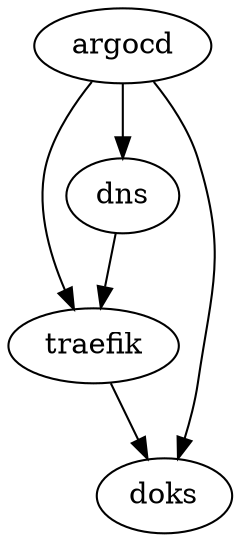
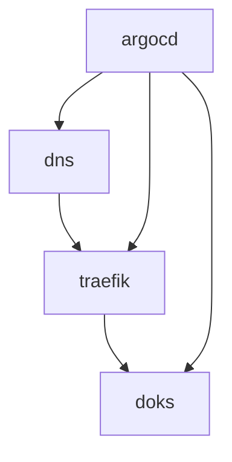

# DigitalOcean Kubernetes (DOKS) — Terragrunt + Terraform

This repository provisions a **DigitalOcean Kubernetes (DOKS)** cluster and supporting pieces: **project + domain**, **Traefik** ingress with **built-in ACME** (Let’s Encrypt DNS-01 via DigitalOcean), **DNS A records**, and **Argo CD** GitOps. Infrastructure is split into **Terragrunt stacks** under `environments/dev/` with separate state per stack, explicit **dependencies**, and **DRY** shared config.

## Project aim

The goal of this project is to provide a small, repeatable Kubernetes platform on DigitalOcean:

- **Terraform/Terragrunt owns the platform foundation:** DigitalOcean project, DOKS cluster, DNS records, Traefik, and Argo CD.
- **Argo CD owns Kubernetes application management:** application manifests live in Git and are synced into the cluster from `k8s/apps/dev`.
- **Traefik is the cluster ingress layer:** services running in the cluster are exposed through Traefik, with TLS certificates issued by Traefik's built-in ACME resolver.
- **Domain names are environment configuration:** domain-related values come from the environment config and Terraform/Terragrunt inputs rather than being hard-coded into reusable modules.

In practice, Terraform should bootstrap enough infrastructure for Argo CD to take over day-to-day Kubernetes object management. After the platform is up, new services should usually be added as Kubernetes manifests under the Argo CD sync path, not as Terraform-managed Kubernetes resources.

## Why Terragrunt?

- **Separate state** per layer (cluster vs addons vs DNS) for safer blast radius and parallel plans where possible.
- **`dependency` blocks** wire Kubernetes/Helm providers from the `doks` stack outputs (endpoint, token, CA).
- **`environments/dev/env.hcl`** holds non-secret defaults; tokens and Argo CD password hash come from **`TF_VAR_*`** / **`DO_TOKEN`**.

## Stack layout and dependency graph

Terragrunt resolves dependencies from `environments/dev/*/terragrunt.hcl` (`dependency` and `dependencies` blocks). **Verified** with `terragrunt graph-dependencies` from `environments/dev/` (also: `./scripts/tg.sh graph`):


```dot
digraph {
	"argocd" -> "traefik";
	"argocd" -> "dns";
	"argocd" -> "doks";
	"dns" -> "traefik";
	"traefik" -> "doks";
}
```

| Stack | Depends on | Purpose |
|-------|------------|---------|
| `doks` | — | DO project, domain, DOKS cluster, project↔resource attachment |
| `traefik` | `doks` | Traefik Helm (LoadBalancer), **ACME `letsencrypt` resolver** (DNS-01, `DO_AUTH_TOKEN`), dashboard `IngressRoute` |
| `dns` | `traefik` | DO DNS A records → Traefik LB IP |
| `argocd` | `doks`, `traefik`, `dns` | Argo CD + `argocd-apps` Application (`dependency` on `doks` for Helm kube config; `dependencies` so it runs after Traefik + DNS) |

**Apply order:** `terragrunt run-all apply` runs **`doks`** → **`traefik`** → **`dns`** → **`argocd`**.

**TLS:** Certificates are issued by **Traefik’s ACME** (certificate resolver `letsencrypt`), not cert-manager. The same DigitalOcean API token is stored in a Kubernetes secret and exposed to Traefik as **`DO_AUTH_TOKEN`** for the DNS challenge. Use Ingress / IngressRoute annotations such as `traefik.ingress.kubernetes.io/router.tls.certresolver: letsencrypt` for app hosts (see `k8s/apps/dev/loading-page/ingress.yaml`). Traefik uses Let’s Encrypt production ACME by default; add the staging `caServer` only for testing certificate issuance.


```mermaid
flowchart TD
  doks["doks"]
  traefik["traefik"]
  dns["dns"]
  argo["argocd"]
  traefik --> doks
  dns --> traefik
  argo --> doks
  argo --> traefik
  argo --> dns
```

## Repository layout

```
.
├── Makefile                     # Shortcuts: tg-clean, tg-init, tg-plan, …
├── scripts/tg.sh                # Terragrunt helpers (cache, run-all, graph, env-check)
├── .env.example                 # Template for TF_VAR_* — copy to .env (gitignored)
├── environments/
│   ├── root.hcl                 # Shared backend generation (S3/Spaces when configured, local otherwise)
│   └── dev/
│       ├── env.hcl              # Non-secret locals (region, cluster size, domain, email, …)
│       ├── doks/terragrunt.hcl  # Only Terragrunt: inputs + terraform { source = … }
│       ├── traefik/
│       ├── dns/
│       └── argocd/
├── terraform/stacks/            # Terraform root modules (one directory per stack)
│   ├── doks/
│   ├── traefik/
│   ├── dns/
│   └── argocd/
├── modules/                     # Shared modules called from terraform/stacks/*
│   ├── digitalocean/cluster
│   ├── digitalocean/network
│   └── kubernetes/{traefik,argocd}
├── k8s/apps/dev/                # Sample manifests; path used by Argo CD
└── .github/
    ├── scripts/                 # terraform install; checkout logic is inlined in workflows
    └── workflows/
        ├── fmt-validate.yml         # on every push + PRs: fmt, hclfmt, validate
        ├── terraform.yml             # main + PRs: plan only (no apply)
        └── terragrunt-apply.yml      # deploy/** tags: apply
```

**Why split `environments/` vs `terraform/stacks/`?**  
`environments/` holds **environment-specific** Terragrunt only (dependencies, inputs, generated modules, generated backend config). **`terraform/stacks/`** holds the Terraform root modules once, referenced via `terraform { source = "${get_repo_root()}/terraform/stacks/<stack>" }`. That matches the usual pattern: **thin environment config**, **one copy of each stack’s `.tf` files**, shared **`modules/`**.

### Implementation notes

- Each `environments/dev/<stack>/terragrunt.hcl` can **generate** `*.module.tf` with a **literal** absolute `module.source` (`get_repo_root()` at plan time) because Terraform does not allow `local` values in `module.source`. Run stacks with **Terragrunt**, not raw `terraform` in `terraform/stacks/` alone, or module sources will be missing.
- Kubernetes-dependent stacks read kubeconfig YAML from **`dependency.doks.outputs.kubeconfig`** and configure providers in `terraform/stacks/*/providers.tf`. Helm uses the `kubernetes = { … }` map form required by **Helm provider v3**.
- **Mock outputs** on the `doks` / `traefik` dependencies allow `validate` / `plan` when upstream state is empty (CI / cold start). Real applies use outputs from state after each dependency is applied.

### Remote state

`environments/root.hcl` generates backend configuration for every stack. If `TG_STATE_BUCKET`, `TG_STATE_ENDPOINT`, `AWS_ACCESS_KEY_ID`, and `AWS_SECRET_ACCESS_KEY` are set, it uses an S3-compatible backend such as DigitalOcean Spaces. Otherwise it falls back to a **local** backend with state stored next to each stack (`terraform.tfstate` in that stack directory). Do not commit local state files.

## Adding services

Use Argo CD as the default control plane for Kubernetes workloads:

1. Add or update manifests under `k8s/apps/dev`.
2. Give each service an `Ingress` or `IngressRoute` for its host.
3. Use Traefik TLS annotations, including `traefik.ingress.kubernetes.io/router.tls.certresolver: letsencrypt`.
4. Add the required hostname to `dns_records` in `environments/dev/env.hcl` when the host is a new DNS name that should point to the Traefik LoadBalancer.

Keep Terraform focused on infrastructure and bootstrap components. Avoid managing normal application Deployments, Services, ConfigMaps, or Ingresses directly in Terraform unless they are part of the platform itself.

### DNS records

The DNS stack creates A records from `dns_records` in `environments/dev/env.hcl`. Each key is a record name under `domain_name`; for example:

```hcl
dns_records = {
  "@" = {
    ttl = 60
  }
  argocd = {
    ttl = 300
  }
  api = {
    ttl = 300
  }
}
```

With `domain_name = "bizquery.dev"`, this points `bizquery.dev`, `argocd.bizquery.dev`, and `api.bizquery.dev` to Traefik's LoadBalancer IP. Traefik can issue a separate certificate for each host when the matching Ingress or IngressRoute uses the `letsencrypt` resolver.

### Secrets in apps

Current decision: use native Kubernetes Secrets for now, and let Argo CD manage the manifests that reference or mount those secrets. Do not commit raw secret values into Git. For the initial dev setup, application manifests can reference expected Secret names and keys, while the actual Secret objects can be created manually or added later through a safer secret delivery flow.

DigitalOcean App Platform supports encrypted environment variables, but this project runs workloads on DOKS, so App Platform secrets are not the right backing store for these Kubernetes apps. When this needs to become production-grade, prefer External Secrets Operator with a real backing provider.

Future options:

- External Secrets Operator backed by HashiCorp Vault or another supported remote secret store.
- Sealed Secrets.
- SOPS-encrypted Kubernetes Secrets.
- Manually created Kubernetes Secrets for local/dev only.

Example app manifest pattern:

```yaml
envFrom:
  - secretRef:
      name: my-service-secrets
```

or mount individual secret keys as files:

```yaml
volumes:
  - name: app-secrets
    secret:
      secretName: my-service-secrets
```

## Prerequisites

- [Terraform](https://www.terraform.io/) **>= 1.5** (or compatible OpenTofu)
- [Terragrunt](https://terragrunt.gruntwork.io/) (see `TG_VERSION` in `.github/workflows/*.yml` for the CI pin)
- DigitalOcean API token with permissions for Kubernetes, DNS (for ACME DNS-01), and project resources

## Configure secrets

Export (or use a private `*.auto.tfvars` / CI secrets):

| Variable | Purpose |
|----------|---------|
| `TF_VAR_do_token` or `DO_TOKEN` | DigitalOcean API token (provider + **Traefik ACME DNS challenge**) |
| `TF_VAR_argocd_admin_password_hash` | Bcrypt hash for Argo CD `admin` |

`environments/dev/env.hcl` sets **`email`** for ACME registration (non-secret).

Local file (recommended): copy **`.env.example`** to **`.env`** in the repo root (`.env` is gitignored), then:

```bash
set -a && source .env && set +a
```

To use the **same** DigitalOcean token as in GitHub (**repository secret `DO_TOKEN`**, wired in `terragrunt-apply.yml` to `TF_VAR_do_token` / `DO_TOKEN`), install [GitHub CLI](https://cli.github.com/) and run `gh auth login`. If `TF_VAR_do_token` is unset after loading `.env`, `./scripts/tg.sh` runs `gh secret get DO_TOKEN` automatically. To ignore a stale value in `.env`, run with `TG_DO_TOKEN_FROM_GITHUB=1`.

## Helpers (Makefile and `scripts/tg.sh`)

| Command | What it does |
|---------|----------------|
| `make tg-clean` / `./scripts/tg.sh clean-cache` | Delete all `environments/**/.terragrunt-cache` directories (forces a fresh module copy on next run) |
| `make tg-init` / `./scripts/tg.sh init-all` | `terragrunt run-all init` from `environments/dev` |
| `make tg-validate` / `./scripts/tg.sh validate-all` | `terragrunt run-all validate` |
| `make tg-plan` / `./scripts/tg.sh plan-all` | `terragrunt run-all plan` |
| `make tg-apply` / `./scripts/tg.sh apply-all` | `terragrunt run-all apply` (runs `env-check` first) |
| `make tg-graph` / `./scripts/tg.sh graph` | Print `terragrunt graph-dependencies` (DOT) |
| `./scripts/tg.sh graph-mermaid` | Print a Mermaid diagram of the same graph (for docs / viewers) |
| `./scripts/tg.sh env-check` | Verify `TF_VAR_do_token` / `DO_TOKEN` and `TF_VAR_argocd_admin_password_hash` are set |
| `make tg-fmt` | `terraform fmt` on `modules/` + `terraform/`, `terragrunt hclfmt` on `environments/dev` |

Pass extra flags through to Terragrunt after init-all, e.g. `./scripts/tg.sh init-all -reconfigure`.

## Usage

From the repo root:

```bash
set -a && source .env && set +a   # or export manually

make tg-init        # or: ./scripts/tg.sh init-all
make tg-plan        # or: cd environments/dev && terragrunt run-all plan
make tg-apply       # or: ./scripts/tg.sh apply-all
```

Or `cd environments/dev` and use `terragrunt run-all plan` / `apply` directly.

Single stack:

```bash
cd environments/dev/doks
terragrunt plan
terragrunt apply
```

Formatting:

```bash
make tg-fmt
```

## CI

Workflows do **not** use third-party Actions (for example `actions/checkout` or `hashicorp/setup-terraform`), so they still run under org policies that only allow Actions from your own org. The first step **must** clone via inline shell (no repo file yet); Terraform install uses **`.github/scripts/ci-install-terraform.sh`** after that. Terragrunt is installed with **`curl`** from its release binary. **`.github/scripts/ci-checkout.sh`** mirrors the clone logic for local testing only.

GitHub Actions: **`fmt-validate.yml`** runs `terraform fmt`, `terragrunt hclfmt`, and `terragrunt run-all validate` on **every branch push** and on **pull requests**. **`terraform.yml`** runs `run-all plan` on **`main`** pushes and pull requests. Neither applies in CI.

**Apply from CI (tag-based):** push an annotated tag whose name matches `deploy/**` (for example `deploy/20250421-143000`). Workflow **`.github/workflows/terragrunt-apply.yml`** runs `terragrunt run-all apply` in `environments/dev` only if the tagged commit is on **`main`**. Helper:

```bash
./scripts/tag-deploy.sh --help   # usage, examples
./scripts/tag-deploy.sh          # creates deploy/<UTC timestamp>, pushes → apply in CI
./scripts/tag-deploy.sh deploy/my-release
```

Configure repository secrets **`DO_TOKEN`** and **`ARGOCD_ADMIN_PASSWORD_HASH`** (and use a protected [environment](https://docs.github.com/en/actions/deployment/targeting-different-environments/using-environments-for-deployment) if you want approvals). For local applies, use `make tg-apply` / `./scripts/tg.sh apply-all` as usual.

## Providers

Stacks pin **DigitalOcean**, **Kubernetes**, **Helm**, and **template** (Traefik Helm values template) where needed; versions are resolved per stack’s `versions.tf` and lock files created after `terragrunt init`.
